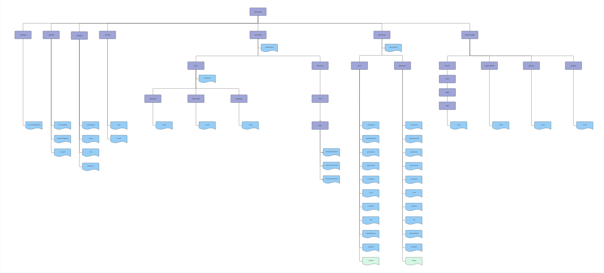
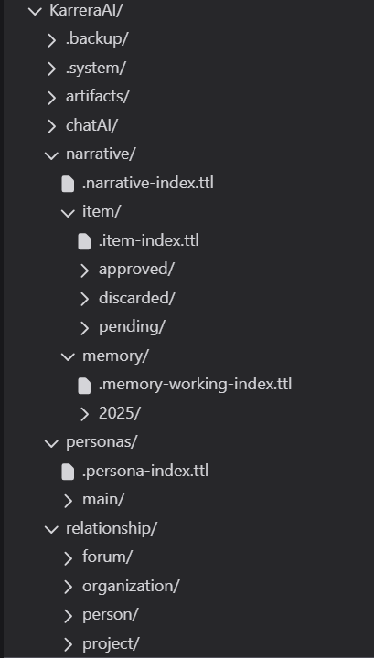
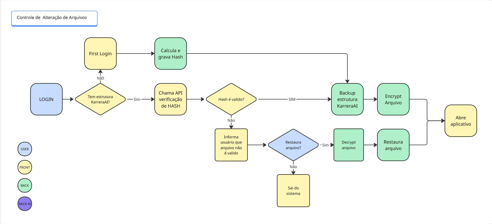

# Solid

All user's information will be stored in a Solid POD. This structure will guarantee that the users's personal data are not stored in our servers and therefore prevent these information from being used without user's approval.

This data repository stores various aspects of an individual's professional and personal profile, career capital, and interactions, organized using a structured schema. The files are primarily .ttl (Turtle) files, which are a syntax for RDF (Resource Description Framework), indicating a graph-like data structure where relationships between entities are explicit.

## FOLDER STRUCTURE

The application data are stored using a folder struture as follows:





## List of Files

These files are used to store specific information from each user and will be described further in this document:

* YYYY-MM-DDThhmmssZ.kar
* .version.ttl
* .artifacts-index.ttl
* .narrative-index.ttl
* .item-index.ttl
* .memory-working-index.ttl
* .memory-discarded-index.ttl
* .memory-longterm-index.ttl
* .persona-index.ttl
* .forum-index.ttl
* .organization-index.ttl
* .person-index.ttl
* .project-index.ttl
* .CCIH-Definitions.ttl
* CCIH-history.ttl
* CCIH.ttl
* .WorkDNA-Definitions.ttl
* WorkDNA-history.ttl
* WorkDNA.ttl
* PAI.ttl
* MSG.ttl
* PI-history.ttl
* PI.ttl
* item.ttl
* organization.ttl
* person.ttl
* project.ttl

## Files Descriptions

### YYYY-MM-DDThhmmssZ.kar

**Description**

This is an encripted tar file that contains the whole **KarreraAi** folder content. It will be used as a source to restore user's data in case of file corruption and/or deletion.

**Workflow Diagram**



### .version.ttl

**File Location**

<User's POD>/KarreraAI/.system/

**Description**

This file is used to define the **KarreraAi Data Structure** version. It will be used to check version and decide whether to update the structure or reject the user login depending on the situation.

**File Structure**

```ttl title=".version.ttl" linenums="1"
@prefix dcterms: <http://purl.org/dc/terms/> .
@prefix esco:    <http://data.europa.eu/esco/model#> .
@prefix schema:  <https://schema.org/> .
@prefix skos:    <http://www.w3.org/2004/02/skos/core#> .
@prefix xsd:     <http://www.w3.org/2001/XMLSchema#> .

</a7bcfbf7-92bd-4cbe-96e9-2ee737970e26/KarreraAI/.system/.version.ttl>
        a                   schema:Dataset;
        dcterms:date        "YYYY-MM-DD"^^xsd:date;
        dcterms:hasVersion  "1.0";
        schema:description  "Este arquivo informa a versão do POD do usuário".
```

**Fields Description**

* **dcterms:date** - Last modified date

* **dcterms:hasVersion** - Data structure version

* **schema:description** - File description

### .artifacts-index.ttl

**File Location**

<User's POD>/KarreraAI/artifacts/

**Description**

This file is used to store the list of artifacts uploaded to users's pod. This artifacts can be uploaded by the user itself or by the application backoffice agents. It includes some informations from each artifact that will be described later in this documet.

**File Structure**

```ttl title=".artifacts-index.ttl" linenums="1"
PREFIX dcterms: <http://purl.org/dc/terms/>
PREFIX esco:    <http://data.europa.eu/esco/model#>
PREFIX schema:  <https://schema.org/>
PREFIX skos:    <http://www.w3.org/2004/02/skos/core#>
PREFIX xsd:     <http://www.w3.org/2001/XMLSchema#>

</a7bcfbf7-92bd-4cbe-96e9-2ee737970e26/KarreraAI/artifacts/.artifacts-index.ttl>
    a schema:ItemList;
    schema:itemListElement  [
                            a schema:DigitalDocument;
                            schema:encodingFormat     "application/pdf";
                            schema:datePublished      "YYYY-MM-YYThhmmssZ"^^xsd:dateTime;
                            schema:description        "File Description";
                            schema:genre              "Tipo do arquivo";
                            schema:name               "File Name";
                            schema:archivedAt         </a7bcfbf7-92bd-4cbe-96e9-2ee737970e26/KarreraAI/artifacts/CV.pdf>;
                            schema:url                <File URL>;
                            schema:creativeWorkStatus "Processed";
                            schema:subjectOf    [
                                                a schema:Event;
                                                schema:name "Upload event"
                                                ]
                            ] .
```

**Fields Description**

* **schema:encodingFormat** - File encoding format
* **schema:datePublished** - Date and Time when the file was uploaded (Format: YYYY-MM-YYThhmmssZ) 
* **schema:description** - File description
* **schema:genre** - The genre of the file. It is used to define the category of the file. It can be one of the following options:
    * CV
    * Scrape
    * Personal Document
    * Project Document
* **schema:name** - Artifact name
* **schema:archivedAt** - Folder where the file is stored at users's POD
* **schema:url** - URL from where the file was downloaded
* **schema:creativeWorkStatus** - File processment status. It can be one of the following options:
    * Processed
    * Pending
* **schema:subjectOf**
    * **schema:name** - Name of the process that generated that file. It can be one of the following options:
        * Uploaded by user
        * Scrape from WEB
        * Upload during first login

### .narrative-index.ttl

**File Location**

<User's POD>/KarreraAI/narrative/

**Description**

This file stores a list o narratives for the user. Each narrative is a collection of memories. Each entry describes the nature of the narratives, its purpose, and the memory targets it contains.

**File Structure**

```ttl title=".narrative-index.ttl" linenums="1"
@prefix dcterms: <http://purl.org/dc/terms/> .
@prefix esco:    <http://data.europa.eu/esco/model#> .
@prefix schema:  <https://schema.org/> .
@prefix skos:    <http://www.w3.org/2004/02/skos/core#> .
@prefix xsd:     <http://www.w3.org/2001/XMLSchema#> .

</a7bcfbf7-92bd-4cbe-96e9-2ee737970e26/KarreraAI/narrative/.narrative-index.ttl>
        a schema:ItemList;
        schema:itemListElement  <#f8feeb3c-0a1f-4222-873e-e216a5978eb3> .    
        
<#f8feeb3c-0a1f-4222-873e-e216a5978eb3> 
    a schema:action ;
    schema:name         "Narrative name" ;
    schema:description  "Narrative description" ;
    schema:target       </a7bcfbf7-92bd-4cbe-96e9-2ee737970e26/KarreraAI/narrative/memory/2025/04/.memory-working-index.ttl#4c5cc5d2-63fe-4554-a17f-b68403573f43> ,
                        </a7bcfbf7-92bd-4cbe-96e9-2ee737970e26/KarreraAI/narrative/memory/2025/04/.memory-longterm-index.ttl#79a65b9a-7bd2-4605-ac8e-6a89d8ff720a> ,
                        </a7bcfbf7-92bd-4cbe-96e9-2ee737970e26/KarreraAI/narrative/memory/2025/04/.memory-discarded-index.ttl#daaefefd-442c-44fb-a616-5a8a82ca505c> ;
    schema:endTime      "YYYY-MM-DDThhmmssZ"^^xsd:dateTime .
```

**Fields Description**

* **schema:name** - Narrative name
* **schema:description** - Description of the narrative and its purpose
* **schema:target** - References to memories included in this narrative
* **schema:endTime** - Timestamp indicating when the action was completed (Format: YYYY-MM-DDThhmmssZ)

### .item-index.ttl

**File Location**

<User's POD>/KarreraAI/narrative/item/

**Description**

This file stores a list o items of memories generated for the user. Each entry represents the results of a specific memory process extraction including its status, result location, and completion timestamp. These items are part of a memory that will be described in another topic.

**File Structure**

```ttl title=".item-index.ttl" linenums="1"
@prefix dcterms: <http://purl.org/dc/terms/> .
@prefix esco:    <http://data.europa.eu/esco/model#> .
@prefix schema:  <https://schema.org/> .
@prefix skos:    <http://www.w3.org/2004/02/skos/core#> .
@prefix xsd:     <http://www.w3.org/2001/XMLSchema#> .

</a7bcfbf7-92bd-4cbe-96e9-2ee737970e26/KarreraAI/narrative/item/.item-index.ttl>
    a schema:ItemList;
    schema:itemListElement  [ 
                            a schema:action ;
                            schema:endTime  "YYYY-MM-DDThhmmssZ"^^xsd:dateTime ;
                            schema:result   </a7bcfbf7-92bd-4cbe-96e9-2ee737970e26/KarreraAI/narrative/item/pending/11c741e6-3f7c-4919-9334-8d3118ae6bec.ttl> ;
                            schema:object   "The process that generate this item" ;
                            schema:status   "Item status"                                 
                            ] .
```

**Fields Description**

* **schema:endTime** - Timestamp indicating when the process was completed (Format: YYYY-MM-DDThhmmssZ)
* **schema:result** - Link to the resulting item generated by the process
* **schema:object** - Name of the process that generated this item. It can be one of the following:
    * CV Extraction
    * Scrape WEB
* **schema:status** - Item processment status. It can be one of the following options:
    * Working
    * Long Term
    * Discarded
