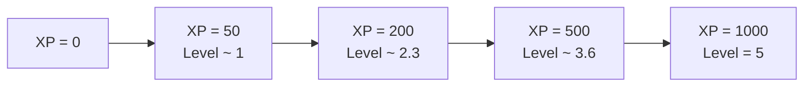
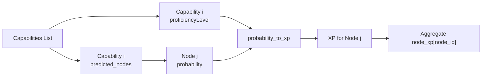
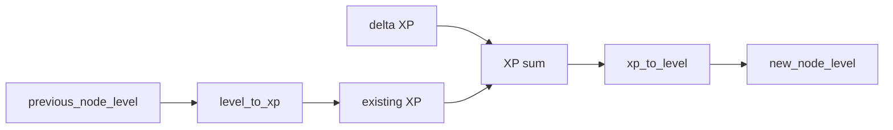

## WorkDNA Calculations – Full Reference

This document explains all the formulas, constants, and variables used in `src/dna_converter.py`.  
It also includes diagrams to show how data flows through the system and how the core curves behave.

---

## 1. Core Concepts

- **XP (Experience Points)**:  
  Continuous numeric score that accumulates evidence for a capability or WorkDNA node. Higher XP = stronger, more reliable evidence.

- **Level (0–5)**:  
  Human-friendly representation of XP on a fixed scale:
  - 0: no/very weak evidence
  - 1: basic exposure
  - 3: solid practitioner
  - 5: mastery (targeted around 1000 XP)

- **Source**:  
  Where the capability evidence comes from (job, certification, portfolio, self-reported skills, etc.). Different sources have different **weights**.

- **Growth Type**:  
  Shape of how XP grows with **duration** of experience:
  - **Saturating** – big early gains, then diminishing returns.
  - **Linear** – each month adds roughly the same amount.
  - **Compounding** – later years are even more valuable than early ones.

- **Time Decay**:  
  Older experience is discounted versus more recent experience, but never falls below a floor (e.g., at least 40% of value is kept).

- **Time Consumption**:  
  Fraction of time spent on a capability (part-time vs full-time). Currently mocked as 1.0 (full-time equivalent) but designed to support real fractions later.

---

## 2. Global Constants and Calibration

All of these live at module level in `dna_converter.py` and are computed once at import.

### 2.1 Master XP and Source Limits

- **`MAX_XP = 1000`**  
  Target XP at mastery (corresponds roughly to **level ≈ 5**).

- **`MAX_SOURCE_WEIGHT = 6`**  
  Highest possible weight for a source, used mainly for calibration.  
  Examples: `current_job`, `project_task_delivery` both use weight 6.

---

### 2.2 Growth Exponents

These define how sharply XP grows with time:

- **`K_SATURATING = 0.5`** – sublinear, diminishing returns.
- **`K_LINEAR = 1.0`** – linear growth.
- **`K_COMPOUNDING = 1.2`** – superlinear, accelerating growth.

General growth term:

```math
f(\text{duration\_months}) = C \cdot \text{duration\_months}^{k}
```

- `C`: growth coefficient for that type.
- `k`: one of the exponents above.

---

### 2.3 Mastery Durations

These encode “how many months until mastery” for each growth type:

- **`MASTERY_MONTHS_SATURATING = 144`** (12 years)
- **`MASTERY_MONTHS_LINEAR = 144`** (12 years)
- **`MASTERY_MONTHS_COMPOUNDING = 240`** (20 years)

At these durations, with `source_weight = MAX_SOURCE_WEIGHT` and no decay, we want:

```math
\text{XP} \approx \text{MAX\_XP} = 1000
```

---

### 2.4 Derived C Coefficients

We solve for \(C\) so that at mastery we get `MAX_XP` from a max-weight source:

```math
C = \frac{\text{MAX\_XP}}{\text{MAX\_SOURCE\_WEIGHT} \cdot \text{calibration\_months}^{k}}
```

In code:

- **`C_SATURATING`**:

```math
C_{\text{saturating}} =
\frac{1000}{6 \cdot (144)^{0.5}}
```

- **`C_LINEAR`**:

```math
C_{\text{linear}} =
\frac{1000}{6 \cdot (144)^{1.0}}
```

- **`C_COMPOUNDING`**:

```math
C_{\text{compounding}} =
\frac{1000}{6 \cdot (240)^{1.2}}
```

These are precomputed on import and stored in `GROWTH_TYPES`.

---

### 2.5 Growth Types Lookup (`GROWTH_TYPES`)

`GROWTH_TYPES` is a dictionary:

- Keys: `"saturating"`, `"linear"`, `"compounding"` (case-insensitive in usage).
- Values: dictionaries with:
  - **`"k"`**: exponent $k$.
  - **`"C"`**: coefficient $C$.
  - **`"calibration_months"`**: mastery duration used during calibration.

This powers:

- `get_capability_growth_params(growth_type)`
- `duration_growth_factor(duration_months, growth_type)`
- `max_xp_at_mastery(growth_type, source_weight)`

---

### 2.6 Level Scaling Constants

The XP → Level mapping uses a logarithmic curve with:

- **`S_SCALING_FACTOR = 50`** (S): horizontal stretch parameter.
- **`A_SCALING_FACTOR`** (A): vertical gain parameter, computed as:

```math
A = \frac{5}{\ln\left(\frac{1 + \text{MAX\_XP}}{S}\right)}
```

This makes sure that around `XP ≈ MAX_XP (1000)`, we are near Level 5.

If something goes wrong in the computation (e.g., invalid inputs), the code falls back to:

- `A_SCALING_FACTOR = 1.642`

These two constants are used in:

- `xp_to_level(xp)`
- `level_to_xp(level)`

---

### 2.7 Decay Floor

- **`DECAY_BASE = 0.4`**

Defines the minimum fraction of XP that remains even for very old experience.  
The decay function is:

```math
\text{decay\_factor}(T) = \text{Base} + (1 - \text{Base}) \cdot e^{-\lambda T}
```

Where:
- $T$ = years since the capability was last active.
- $\lambda$ = volatility rate (from `get_volatility_rate()`).

With `Base = 0.4`:
- Very recent experience (T ≈ 0) ⇒ factor close to 1.0.
- Very old experience (T large) ⇒ factor approaches 0.4.

---

## 3. Utility Functions and Their Variables

This section maps each public function to its formula and variable meanings.

### 3.1 `probability_to_xp(probability: float, capability_xp: int) -> int`

**Purpose**: Turn a model probability into XP for a node, scaled by capability strength.

**Inputs**:
- **`probability`**: float in $[0, 1]$, probability that a given node is relevant.
- **`capability_xp`**: XP of the capability itself (usually from `calculate_node_xp`).

**Computation**:

```math
\text{raw\_xp} = \text{probability} \cdot \text{capability\_xp}
```

```math
\text{gained\_xp} = \max(1, \text{round(raw\_xp)})
```

**Key variables**:
- `probability`: node relevance confidence.
- `capability_xp`: strength of the underlying capability.
- `gained_xp`: XP increment assigned to the node.

---

### 3.2 `get_volatility_rate() -> float`

**Purpose**: Returns the decay rate \(\lambda\) for time-based discounting.

**Current value**:

- `λ = 0.11`

Used in:

```math
\text{decay\_factor}(T) = \text{Base} + (1 - \text{Base}) \cdot e^{-\lambda T}
```

**Variable meaning**:
- `λ` (lambda): higher means faster decay; lower means slower decay.

---

### 3.3 `get_decay_base() -> float`

**Purpose**: Returns the asymptotic floor (`Base`) for decay.

**Value**:
- `Base = DECAY_BASE = 0.4`.

This ensures that even very old experience never drops below 40% of its XP.

---

### 3.4 `get_capability_growth_params(growth_type: str) -> (C, k)`

**Purpose**: For a given growth type, return the pair:
- `C`: coefficient.
- `k`: exponent.

Used from `GROWTH_TYPES`, defaults to `"linear"` for unknown inputs.

---

### 3.5 `get_time_consumption_mock(...) -> float`

**Purpose**: Placeholder that returns `1.0` for now.

Intended future meaning:
- 1.0 = full-time.
- 0.5 = half-time, etc.

Currently:
- Ignores `source`, `start_date`, `end_date`, `**kwargs`.
- Always returns `1.0`.

---

### 3.6 `duration_growth_factor(duration_months: float, growth_type: str = "linear") -> float`

**Purpose**: Compute the growth term $f(\text{duration}\_\text{months})$.

**Inputs**:
- `duration_months`: total active time in months.
- `growth_type`: `"saturating"`, `"linear"`, or `"compounding"`.

**Computation**:

1. Retrieve $(C,k)$ from `get_capability_growth_params(growth_type)`.
2. Clamp duration:

```math
\text{duration\_months\_clamped} = \max(1.0, \text{duration\_months})
```

3. Compute:

```math
\text{duration\_factor} = C \cdot (\text{duration\_months\_clamped})^{k}
```

**Variable meanings**:
- `duration_months`: raw months of experience.
- `duration_factor`: growth multiplier feeding into the XP formula.

---

### 3.7 `max_xp_at_mastery(growth_type: str, source_weight: int) -> float`

**Purpose**: Compute the theoretical XP at mastery duration, ignoring decay and time consumption.

**Steps**:

1. From `GROWTH_TYPES[growth_type]`, read:
   - `C`, `k`, `calibration_months`.
2. Compute:

```math
\text{XP\_max} = \text{source\_weight} \cdot C \cdot (\text{calibration\_months})^{k}
```

**Intended usage**:
- Sanity-check the calibration.
- Tune `C` or durations if needed.

---

## 4. XP ↔ Level Conversion

### 4.1 `xp_to_level(xp: int) -> float`

**Purpose**: Map a raw XP amount to a WorkDNA level in $[0, 5]$.

**Formula**:

```math
\text{level\_raw} = A \cdot \ln\left(1 + \frac{\text{XP}}{S}\right)
```

```math
\text{level} = \min(\text{level\_raw}, 5)
```

Where:
- `A = A_SCALING_FACTOR`
- `S = S_SCALING_FACTOR`

**Variables**:
- `xp`: current experience points for a node.
- `level`: level (rounded to 2 decimals, capped at 5).

#### Example values (illustrative)

| XP   | Level (approx) |
|------|----------------|
| 0    | 0.00           |
| 50   | ~1.0           |
| 200  | ~2.3           |
| 500  | ~3.6           |
| 1000 | ~5.0 (cap)     |

> Exact values depend on `A_SCALING_FACTOR` outcome, but the qualitative behavior holds: fast early growth, then flattening.

#### Diagram – XP → Level (logarithmic curve)



---

### 4.2 `level_to_xp(level: float) -> int`

**Purpose**: Inverse mapping – given a level, return the equivalent XP.

**Inverse Formula**:

From:
```math
\text{level} = A \cdot \ln\left(1 + \frac{\text{XP}}{S}\right)
```

We derive:

```math
\text{XP} = S \cdot \left(e^{\frac{\text{level}}{A}} - 1\right)
```

**Implementation**:

```math
\text{xp} = S\_{\text{SCALING\_FACTOR}} \cdot \left(\exp\left(\frac{\text{level}}{A\_{\text{SCALING\_FACTOR}}}\right) - 1\right)
```

**Variables**:
- `level`: node level in [0, 5].
- `xp`: XP quantity corresponding to that level.

---

## 5. Source Weighting

### 5.1 `source_to_weight(source: Optional[str], end_date: Optional[datetime] = None) -> int`

**Purpose**: Convert a free-text description of a source into an integer weight.

**Key pieces**:

- **`source_weights`**:
  - `current_job`: 6
  - `project_task_delivery`: 6
  - `certification_accreditation`: 5
  - `leadership_mentorship_role`: 5
  - `conference_publication_patent`: 5
  - `past_job`: 6
  - `performance_review_mention`: 4
  - `portfolio_public_repository`: 4
  - `university_major_minor`: 3
  - `volunteer_side_project_mention`: 2
  - `self_reported_skill_list`: 1

- **`source_keywords`**: maps these categories to keyword lists (e.g. "certification", "portfolio", "university", "volunteer", etc.).

- **`job_mapping`**: keywords that signal a job (e.g. "job", "role", "engineer", "developer", etc.).

**Logic**:

1. If `source` is `None` or empty → return `1`.
2. Lowercase `source` to `source_lower`.
3. If any keyword from `job_mapping` appears in `source_lower`:
   - Parse `end_date` if string.
   - Compute `three_months_ago = today - 90 days`.
   - If `end_date` missing or ≥ `three_months_ago` → treat as `current_job` (weight 6).
   - Else → treat as `past_job` (weight 6).
4. If not a job:
   - For each `(category, keywords)` in `source_keywords`:
     - If any keyword appears in `source_lower` → return `source_weights[category]`.
5. If no match → return `1`.

**Variables**:
- `source`: textual description (job title, course name, etc.).
- `end_date`: used to determine recency of a job.
- `source_weight`: numeric weight 1–6.

---

## 6. WorkDNA Aggregation from Capabilities

### 6.1 `compute_workdna(capabilities: List[Dict]) -> Dict[str, int]`

**Purpose**: Aggregate per-node XP from a list of capabilities and their predicted nodes.

**Expected capability structure (simplified)**:

```json
{
  "proficiencyLevel": 250,
  "predicted_nodes": [
    { "id": "NODE_1", "probability": 0.9 },
    { "id": "NODE_2", "probability": 0.4 }
  ]
}
```

**Algorithm**:

For each capability `cap`:
1. `exp_weight = cap["proficiencyLevel"]`
2. For each `node` in `cap["predicted_nodes"]`:
   - `node_id = node["id"]`
   - `prob = node["probability"]`
   - `gained_xp = probability_to_xp(prob, exp_weight)`
   - Increment:
```math
\text{node\_xp}[node\_id] \mathrel{+}= \text{gained\_xp}
```

**Output**:
- `node_xp`: dictionary `{ node_id: total_xp }`.

**Variables**:
- `capabilities`: list of capability dicts.
- `exp_weight`: capability-level XP (strength).
- `node_id`: WorkDNA node identifier.
- `prob`: model probability of node activation.
- `gained_xp`: XP increment for that node from that capability.

#### Diagram – From Capabilities to Node XP



---

### 6.2 `calculate_new_node_level(previous_node_level: float, xp: int) -> float`

**Purpose**: Update a node’s level after adding some extra XP.

**Inputs**:
- `previous_node_level`: existing level in [0, 5].
- `xp`: change in XP (usually positive, could be negative if used that way).

**Steps**:
1. Convert old level to XP:
```math
\text{xp\_node} = \text{level\_to\_xp(previous\_node\_level)}
```
2. Add XP delta:
```math
\text{xp\_total} = \text{xp\_node} + \text{xp}
```
3. Convert back to level:
```math
\text{new\_level} = \text{xp\_to\_level(xp\_total)}
```

**Output**:
- New level (capped by the logic in `xp_to_level`, i.e. max 5).

#### Diagram – Incremental Level Update



---

## 7. Full Capability XP Calculation

### 7.1 `calculate_node_xp(...) -> int`

**Purpose**: Compute total XP for one capability instance by combining:
- Duration of experience.
- Source strength.
- Time decay.
- Growth type (shape of experience curve).
- Time consumption.

**Signature (simplified)**:

```python
calculate_node_xp(
    source: Optional[str] = None,
    start_date: Optional[str] = None,
    end_date: Optional[str] = None,
    growth_type: str = "linear",
    time_consumption: Optional[float] = None,
) -> int
```

---

### 7.2 Step-by-Step Breakdown

#### 1. Parse dates

- `start_date_dt = parse_date(start_date)`
- `end_date_dt = parse_date(end_date)`

Each returns a `date` object or `None`.

#### 2. Compute `duration_months`

Four cases:

- **Case 1 – both missing**:
  - `duration_months = 6`
  - `end_date_dt = today`

- **Case 2 – only `end_date`**:
  - `duration_months = 12`

- **Case 3 – only `start_date` (ongoing)**:
  - `end_date_dt = today`
  - Months between start and today:
```math
\text{duration\_months} =
\max\left(1,\ (\text{end\_year} - \text{start\_year}) \cdot 12 + (\text{end\_month} - \text{start\_month})\right)
```

- **Case 4 – both provided**:
  - Similar computation, but between `start_date_dt` and `end_date_dt`.

Always clamped to at least 1 month.

#### 3. Time since last active (`T` in years)

```math
T = \frac{\text{(today - end\_date\_dt).days}}{365.0}
```

This feeds into the decay function.

#### 4. Source weight

- `source_weight = source_to_weight(source, end_date_dt)`

Returns an integer (typically 1–6) based on the logic in section 5.

#### 5. Decay parameters

- `λ = get_volatility_rate()` (≈ 0.11).
- `base = get_decay_base()` (0.4).

Compute:

```math
\text{decay\_factor} = \text{base} + (1.0 - \text{base}) \cdot e^{-\lambda T}
```

#### 6. Duration growth

- `duration_factor = duration_growth_factor(duration_months, growth_type)`

This uses:

```math
\text{duration\_factor} = C \cdot \text{duration\_months}^{k}
```

with `C` and `k` from `GROWTH_TYPES[growth_type]`.

#### 7. Time consumption

- If `time_consumption` is `None`:
  - Use `get_time_consumption_mock(...)` → `1.0`.
- Then:

```math
\text{time\_consumption} = \max(0.0, \text{float(time\_consumption)})
```

#### 8. Final XP formula

Putting everything together:

```math
\text{XP} = \text{source\_weight} \cdot \text{decay\_factor} \cdot \text{duration\_factor} \cdot \text{time\_consumption}
```

Code:

```python
xp = source_weight * decay_factor * duration_factor * time_consumption
return max(1, round(xp))
```

**Variables**:
- `source_weight`: from `source_to_weight`.
- `decay_factor`: from `T`, `λ`, `base`.
- `duration_factor`: from `duration_months`, `growth_type`.
- `time_consumption`: fraction of time spent.
- `xp`: final capability XP (at least 1).

#### Diagram – Capability XP Pipeline

```mermaid
flowchart TB
    A[Input<br/>source, start_date, end_date, growth_type, time_consumption] --> B[Parse dates]
    B --> C[Compute duration_months]
    C --> D[duration_growth_factor<br/>C * months^k]
    B --> E[Compute T]
    A --> F[source_to_weight]
    E --> G[decay_factor(T)]
    A --> H[get_time_consumption_mock or value]

    F --> I[XP = source_weight * decay_factor * duration_factor * time_consumption]
    D --> I
    G --> I
    H --> I
    I --> J[Final capability XP]
```

---

## 8. Curve Intuitions and Example Shapes

These are conceptual examples to illustrate how the main curves behave.

### 8.1 Duration Growth – Different Growth Types

For the same total months, different `growth_type` values yield different `duration_factor`:

| Months | Saturating (k=0.5) | Linear (k=1.0) | Compounding (k=1.2) |
|--------|--------------------|----------------|----------------------|
| 6      | High early boost   | Small          | Very small           |
| 60     | Slower increase    | Medium         | Large                |
| 120    | Approaching plateau| Large          | Very large           |

Conceptually:
- Saturating: strong early returns, then flattens.
- Linear: constant slope.
- Compounding: slow at first, then accelerates.

### 8.2 Time Decay – `decay_factor(T)`

With `Base = 0.4` and `λ = 0.11`:

| T (years since end) | Decay factor (approx) |
|---------------------|-----------------------|
| 0                   | ~1.0                  |
| 1                   | ~0.9                  |
| 3                   | ~0.7                  |
| 6                   | ~0.55                 |
| 10+                 | ≈0.4 (floor)          |

Interpretation:
- Recent work keeps nearly full value.
- Old work is discounted but never useless.

---

## 9. End-to-End Data Flow Summary

End-to-end, the WorkDNA calculations follow this chain:

1. **Capability metadata** (`source`, `start_date`, `end_date`, `growth_type`, etc.)  
   → `calculate_node_xp(...)`  
   → **capability-level XP**.

2. **Model predictions** (`predicted_nodes` with `probability`) and **capability XP**  
   → `probability_to_xp(prob, capability_xp)`  
   → **per-node XP increments**.

3. Node-level XP increments across all capabilities  
   → `compute_workdna(capabilities)`  
   → **aggregated XP per node**.

4. Aggregated node XP  
   → `xp_to_level(xp)`  
   → **WorkDNA levels (0–5)**.

5. For incremental updates (new evidence over time):  
   - Old level + delta XP → `calculate_new_node_level(previous_node_level, xp_delta)`  
   - Produces updated level using the same log curve.

This ensures that:
- All sources and durations are normalized into a single XP scale.
- Recent experience is favored but old experience is preserved.
- Growth types capture different learning trajectories.
- Final levels are easy to interpret, while remaining mathematically grounded.

