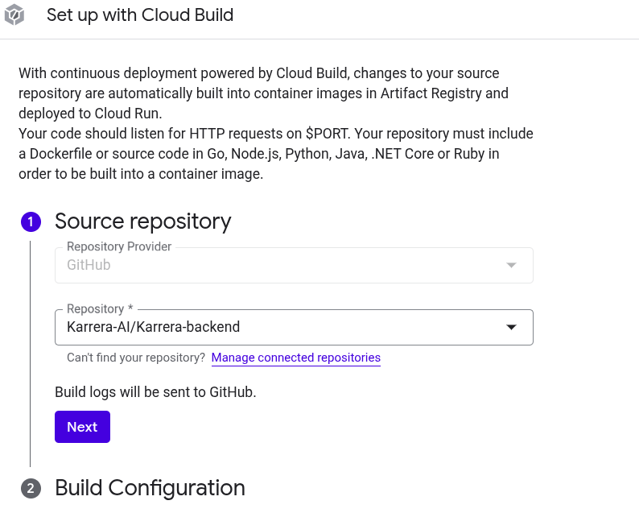
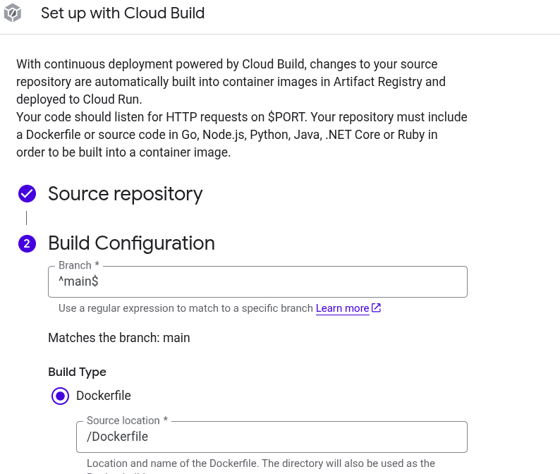

# CI/CD

## CI

## CD

### VM hosted services

CD using Github Action, see exemple below:
https://github.com/Karrera-AI/solid/blob/main/.github/workflows/gcp_workflow.yaml

### Google Cloudrun hosted services

CD using CloudBuild, connecting Github repository with CloudBuild, the initial connection config is already done.

For new services, just select the Github repository and your Branch for CD process.

