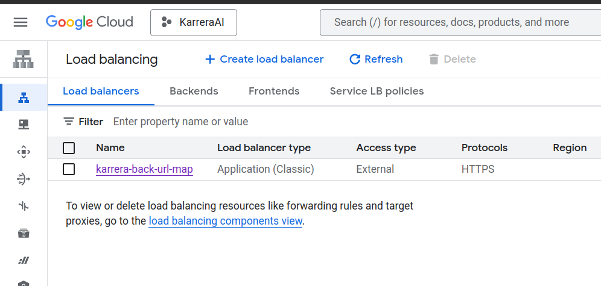
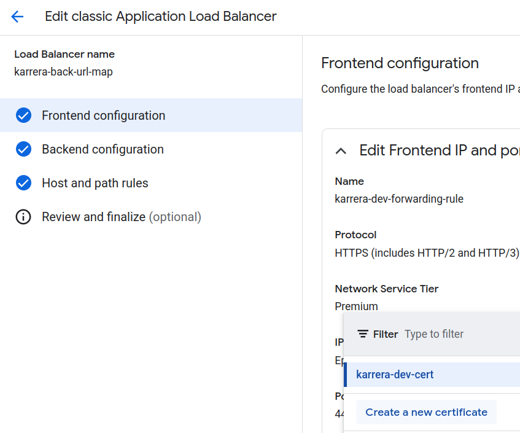
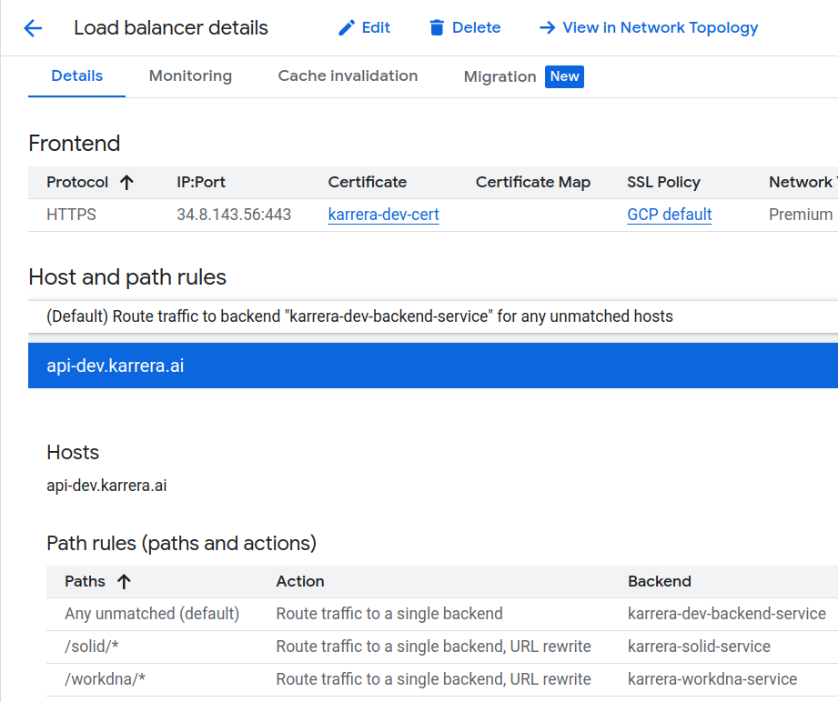

# Load Balancer Setup

This document explains the setup of the GCP Load Balancer for all backend microservices managed by API Gateway, unifying all backend components into the same DNS(dev.karrera.ai/BackendServicePath).

## Overview: Creating DNS for API Gateway

A load balancer is not required for API Gateway to function, it does allow your gateway to take advantage of the benefits of a load balancer. For example, using a global external Application Load Balancer with API Gateway lets you:

* Use custom domains.
* Leverage Google Cloud Armor as a network security service.
* Manage efficient load balancing across gateways in multiple locations.
* Implement advanced traffic management.

What we need here is to set a custom domain for our backend microservices managed by API Gateway.

The whole flow can be illustrated as image below:


## Implementation Steps:
### Step 1: Create serverless NEG for API-Gateway

```
gcloud beta compute network-endpoint-groups create SERVERLESS_NEG_NAME \
  --region=REGION_ID \
  --network-endpoint-type=serverless \
  --serverless-deployment-platform=apigateway.googleapis.com \
  --serverless-deployment-resource=GATEWAY_ID
```
For example:
```
gcloud beta compute network-endpoint-groups create karrera-dev-neg \
  --region=us-central1 \
  --network-endpoint-type=serverless \
  --serverless-deployment-platform=apigateway.googleapis.com \
  --serverless-deployment-resource=gateway-karrera-backend
```

### Step 2: Create a backend service to define how the global external Application Load Balancer distributes traffic

To create a backend service
```
gcloud compute backend-services create BACKEND_SERVICE_NAME --global
```

To add your serverless NEG as a backend to the backend service, run the following command
```
gcloud compute backend-services add-backend BACKEND_SERVICE_NAME \
  --global \
  --network-endpoint-group=SERVERLESS_NEG_NAME \
  --network-endpoint-group-region=REGION_ID
```

### Step 3: Create a URL map to route incoming requests to the backend service

To create the URL map, run the following command
```
gcloud compute url-maps create URL_MAP_NAME \
  --default-service BACKEND_SERVICE_NAME
```

Or create it directly from console:


### Step 4: Create an SSL certificate for your target proxy

To create a self-managed SSL certificate resource:
```
gcloud compute ssl-certificates create SSL_CERTIFICATE_NAME \
  --certificate CRT_FILE_PATH \
  --private-key KEY_FILE_PATH
```

Or create it directly from console, in Load Balancer's Frontend configuration:


### Step 5: Create a target HTTP(S) proxy to route requests to your URL map

To create the target proxy, use the following command:
```
gcloud compute ssl-certificates create gcloud compute target-https-proxies create TARGET_HTTPS_PROXY_NAME \
  --ssl-certificates=SSL_CERT_NAME \
  --url-map=URL_MAP_NAME
```

### Step 6: Create a forwarding rule to route incoming requests to the proxy

Use the following command to create the forwarding rule:
```
gcloud compute forwarding-rules create HTTPS_FORWARDING_RULE_NAME \
  --target-https-proxy=TARGET_HTTPS_PROXY_NAME \
  --global \
  --ports=443
```

### Step 7: Update DNS records with load balancer IP address


## Creating multiple backend services for LB

Repeat step 1 and 2 for new backend service, and update the URL Map path rules.