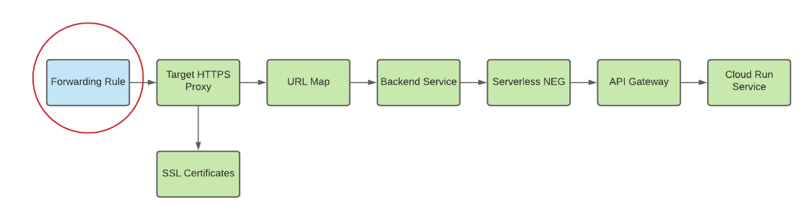

# Load Balancer Setup

This document explains the setup of the GCP Load Balancer for all backend microservices managed by API Gateway, unifying all backend components into the same DNS(dev.karrera.ai/BackendServicePath).

## Overview: Creating DNS for API Gateway

A load balancer is not required for API Gateway to function, it does allow your gateway to take advantage of the benefits of a load balancer. For example, using a global external Application Load Balancer with API Gateway lets you:

* Use custom domains.
* Leverage Google Cloud Armor as a network security service.
* Manage efficient load balancing across gateways in multiple locations.
* Implement advanced traffic management.

What we need here is to set a custom domain for our backend microservices managed by API Gateway.

The whole flow can be illustrated as image below:



## Implementation Steps:
### Step 1: Create serverless NEG for API-Gateway

```
gcloud beta compute network-endpoint-groups create SERVERLESS_NEG_NAME \
  --region=REGION_ID \
  --network-endpoint-type=serverless \
  --serverless-deployment-platform=apigateway.googleapis.com \
  --serverless-deployment-resource=GATEWAY_ID
```
For example:
```
gcloud beta compute network-endpoint-groups create karrera-dev-neg \
  --region=us-central1 \
  --network-endpoint-type=serverless \
  --serverless-deployment-platform=apigateway.googleapis.com \
  --serverless-deployment-resource=gateway-karrera-backend
```

### Step 2: Create a backend service to define how the global external Application Load Balancer distributes traffic

To create a backend service
```
gcloud compute backend-services create BACKEND_SERVICE_NAME --global
```